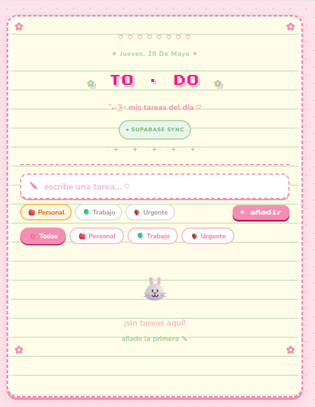
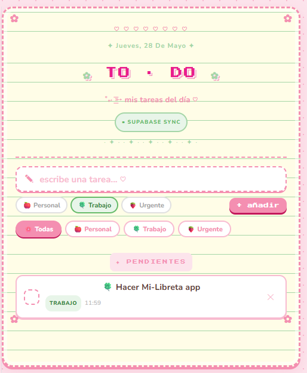
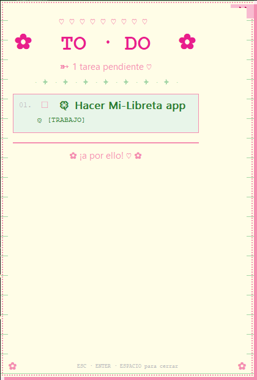

# Mi Libreta 

**Mi Libreta** es una aplicación web de tareas con estética visual cuidada, pensada para organizar tareas personales, de trabajo o urgentes de una forma sencilla y bonita.

Además de la aplicación web, el proyecto incluye un pequeño script de escritorio que se conecta a la misma base de datos y muestra una ventana emergente con las tareas pendientes al iniciar el ordenador.

---

##  Demo

 **Aplicación desplegada:**
https://mi-libreta-lilac.vercel.app

---

##  Capturas de pantalla

### Pantalla principal Sin Tareas





---

### Pantalla principal Con Tareas





---

### Ventana emergente de escritorio





---

##  Funcionalidades principales

* Crear tareas.
* Consultar tareas pendientes.
* Marcar tareas como completadas.
* Clasificar tareas por categoría:

  * Personal.
  * Trabajo.
  * Urgente.
* Interfaz visual con estilo de libreta.
* Almacenamiento de datos en Supabase.
* Despliegue web en Vercel.
* Script de escritorio que muestra las tareas pendientes al iniciar el ordenador.

---

##  Script de escritorio

El proyecto también incluye un script en Python que funciona como recordatorio visual.

Este script:

* Se conecta a Supabase.
* Consulta las tareas que aún no están completadas.
* Muestra una ventana flotante con estética de libreta.
* Se coloca en la parte derecha de la pantalla.
* Permanece por encima de otras ventanas.
* Se puede cerrar con:

  * `ESC`
  * `ENTER`
  * `ESPACIO`
  * Botón `X`
* Permite hacer scroll si hay muchas tareas.
* Tiene animación de escritura para mostrar las tareas poco a poco.

Además, se puede ejecutar automáticamente al iniciar Windows mediante un archivo `.bat`.

---

##  Ejecución automática en Windows

Para que el recordatorio aparezca al encender el ordenador, se utiliza un archivo `.bat` que ejecuta el script unos segundos después del inicio.

Ejemplo de archivo `.bat`:

```bat
@echo off
timeout /t 10 /nobreak
python "RUTA_DEL_SCRIPT\recordatorio.py"
```

Este archivo puede colocarse en la carpeta de inicio de Windows:

```txt
shell:startup
```

De esta forma, al abrir el ordenador, Windows espera unos segundos y después ejecuta el recordatorio de tareas.

---

##  Tecnologías utilizadas

### Frontend

* React
* Vite
* JavaScript
* CSS

### Backend / Base de datos

* Supabase

### Despliegue

* Vercel

### Script de escritorio

* Python
* Tkinter
* Supabase Python Client
* Archivo `.bat` para ejecución automática

---

##  Estructura del proyecto

```txt
mi-libreta/
│
├── public/
├── src/
│   ├── components/
│   ├── App.jsx
│   ├── main.jsx
│   └── ...
│
├── package.json
├── vite.config.js
└── README.md
```

Si se añade el script de escritorio al repositorio, una posible estructura sería:

```txt
mi-libreta/
│
├── desktop/
│   ├── todolist.py
│   └── iniciar_recordatorio.bat
│
├── public/
├── src/
└── README.md
```

---

##  Instalación y ejecución

Clona el repositorio:

```bash
git clone https://github.com/angelalop03/mi-libreta.git
```

Entra en la carpeta del proyecto:

```bash
cd mi-libreta
```

Instala las dependencias:

```bash
npm install
```

Ejecuta el proyecto en local:

```bash
npm run dev
```

---

##  Variables de entorno

Para conectar la aplicación con Supabase, se recomienda usar variables de entorno.

Crea un archivo `.env` en la raíz del proyecto:

```env
VITE_SUPABASE_URL=TU_URL_DE_SUPABASE
VITE_SUPABASE_ANON_KEY=TU_CLAVE_ANONIMA_DE_SUPABASE
```

En el script de Python también es recomendable evitar escribir las claves directamente en el código. Se pueden guardar como variables de entorno o en un archivo `.env`.

---

##  Objetivo del proyecto

El objetivo de **Mi Libreta** es crear una aplicación sencilla, visual y práctica para organizar tareas del día a día.

El proyecto combina una aplicación web con un recordatorio de escritorio, de forma que las tareas no solo quedan guardadas en la web, sino que también pueden aparecer automáticamente al iniciar el ordenador.

---

##  Futuras mejoras

* Permitir editar tareas.
* Añadir fechas límite.
* Añadir modo oscuro.
* Mejorar el diseño responsive.
* Convertir el script de escritorio en una aplicación instalable.
* Añadir notificaciones del sistema.
* Crear estadísticas de tareas completadas.

---
##  Autora

Proyecto desarrollado por **Angela López**.

GitHub: [@angelalop03](https://github.com/angelalop03)
